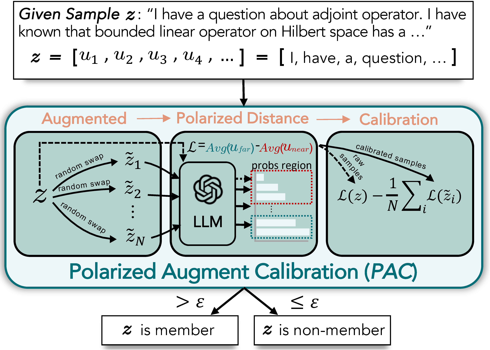

<div align="center">

<h2>Data Contamination Calibration for Black-box LLMs</h2>

[Wentao Ye](https://github.com/yyy01)<sup>1</sup>, &nbsp; Jiaqi Hu<sup>1</sup>, &nbsp; Liyao Li<sup>1</sup>, &nbsp; [Haobo Wang](https://hbzju.github.io/)<sup>1</sup>, &nbsp; Gang Chen<sup>1</sup>, &nbsp; [Junbo Zhao](https://scholar.google.com/citations?user=8ipao8MAAAAJ&hl=en)<sup>1</sup>

<sup>1</sup>Zhejiang University




</div>


Paper (to-be-released) | StackMIA Framework (to-be-released) |  [StackMIAsub Benchmark](https://huggingface.co/datasets/darklight03/StackMIAsub) | [Polarized Augment Calibration Method](##-Detect-Data-Contamination-with-PAC) (i.e. the following repo) 

## News 🔥

- [2024/05/19] We release our code and benchmark.
- [2024/05/16] Our paper is accepted by [ACL 2024](https://2024.aclweb.org/)! 🎉

## Overview
The rapid advancements of Large Language Models tightly associate with the expansion of the training data size. However, the unchecked ultra-large-scale training sets introduce a series of **potential risks like data contamination**. To trackle this challenge, we propose a holistic method named **Polarized Augment Calibration (PAC)** along with a brand-new dataset named **StackMIA** to detect the contaminated data and diminish the contamination effect. Remarkably, PAC is plug-and-play that can be integrated with most **current white- and black-box models.**

## StackMIAsub benchmark

The **StakcMIAsub** dataset serves as a benchmark, which supports most white- and black-box models, to evaluate membership inference attack (MIA) methods:

- **Black-box OpenAI models:**
    - *Davinci-002*
    - *Baggage-002*
    - *...*
- **White-box models:**
    - *LLaMA and LLaMA2*
    - *Pythia*
    - *OPT*
    - *...*

Access our [Hugging Face](https://huggingface.co/datasets/darklight03/StackMIAsub) repo for more details.

## Detect Data Contamination with PAC

### Data preparation

📌 Please ensure the data to be detected is formatted as a `jsonlines` file in the following manner:

```json
{"snippet": "SNIPPET1", "label": 1 or 0}
{"snippet": "SNIPPET2", "label": 1 or 0}
```
- `label` is an optional field for labeled detection.
- *label 1* denotes to members, while *label 0* denotes to non-members.

### Run PAC using black-box OpenAI models

Set your API key and target model engine to run PAC on OpenAI models (increase `num_threads` for batch processing):
```bash
python attack.py --dataset_path "DATASET_PATH" --api_key "YOUR_API_KEY" --model_engine "TARGET_MODEL_ENGINE" 
```

> **Note:** the extra probabilistic tracking step will be performed for **GPT-3.5** and **GPT-4** models.

### Run PAC using white-box models

Use the following command to run PAC on local white box models:
```bash
python attack.py --dataset_path "DATASET_PATH" --model_path "MODEL_PATH"
```

## Acknowledgement

Thanks for the following repos:
- [Reverse engineered ChatGPT API](https://github.com/acheong08/ChatGPT)
- [eda_nlp](https://github.com/jasonwei20/eda_nlp)

## Cite our work
⭐️ If you find our implementation and paper helpful, please kindly cite our work :

```bibtex
to-be-released
```